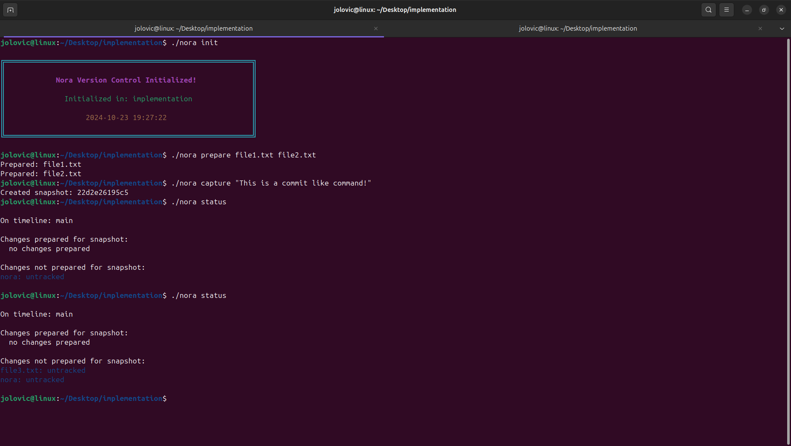
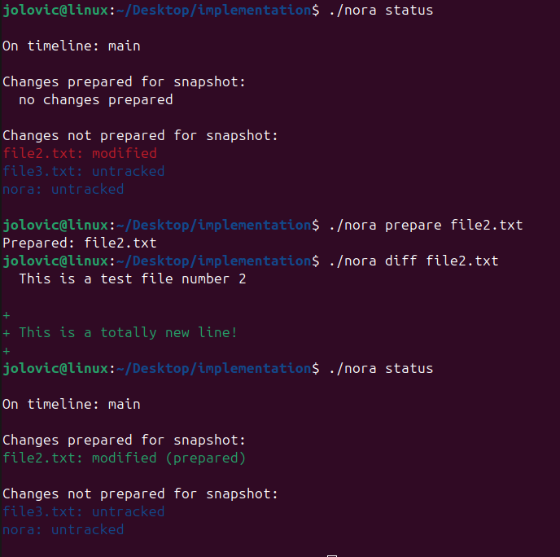

# Nora V1 - Version Control System

**Nora** is an small version tracking system that I'm developing while learning Go.
Inspired by Git.

<div style="display: flex; align-items: center; gap: 20px;">
    
    
</div>

## Core Concepts

| Nora      | Traditional VCS |
| --------- | --------------- |
| Snapshot  | Commit          |
| Timeline  | Branch          |
| Story     | Repository      |
| Preparing | Staging         |

## Commands

```bash
./nora init      # Start a new story
./nora prepare   # Prepare files for snapshot (single, multiple, or '.' for all)
./nora forget    # Remove files from tracking
./nora capture   # Create a new snapshot
./nora recall    # View previous snapshots
./nora status    # Check current story status
```

## Get started

```bash
make build    # Build the project
make run      # Run the project
```
